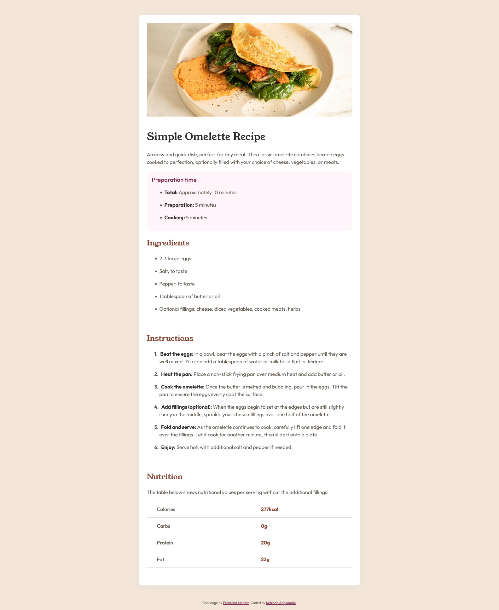

# Frontend Mentor - Recipe page solution

This is a solution to the [Recipe page challenge on Frontend Mentor](https://www.frontendmentor.io/challenges/recipe-page-KiTsR8QQKm). Frontend Mentor challenges help you improve your coding skills by building realistic projects. 

## Table of contents

- [Overview](#overview)
  - [The challenge](#the-challenge)
  - [Screenshot](#screenshot)
  - [Links](#links)
- [My process](#my-process)
  - [Built with](#built-with)
  - [What I learned](#what-i-learned)
- [Author](#author)


## Overview

### Screenshot



### Links

- Solution URL: [my solution](https://www.frontendmentor.io/solutions/recipe-page-6H1NS0HqnW)
- Live Site URL: [Recipe Page](https://recipe-page5.netlify.app/)

## My process

### Built with

- Semantic HTML5 markup
- CSS custom properties
- Flexbox
- Mobile-first workflow

### What I learned

I learned custom styling of the numbers in ordered list

Here's a snippet:

```css
ol {
  list-style-type: none;
  counter-reset: list-counter;
}

ol li {
  counter-increment: list-counter;
}

ol li::before {
  content: counter(list-counter) ". ";
  font-weight: bold; /* Make the number bold */
  margin-right: 5px; /* optional: add some space between the number and the text */
}
```

## Author

- Website - [Kehinde Adejumobi](https://www.kehinde-adejumobi.netlify.app)
- Frontend Mentor - [@Perception12](https://www.frontendmentor.io/profile/Perception12)
- Twitter - [@_perceptron__](https://twitter.com/_perceptron__)
